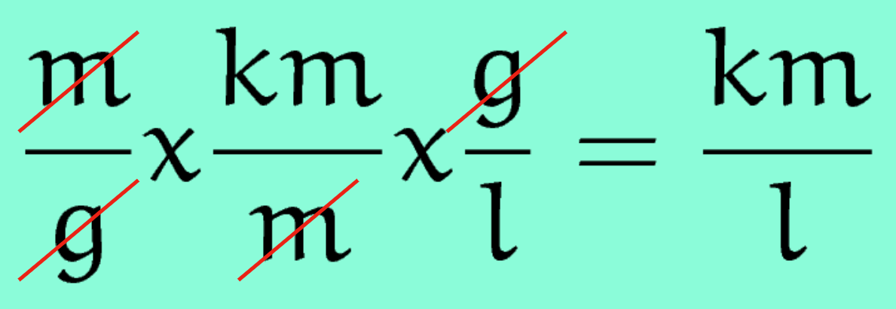

# MPG to KPL Converter Solution in Python Spring 2022

A MPG to KPL converter program written in python for my ISAT 252 introductory programming class in Spring 2022.

The `requirements.txt` file contains a list of all of the 3rd party packages and libraries that were used in this project.

To install this project on your own computer:

1. Clone this repo locally
2. Open it up in an editor like VSCode
3. In the terminal, initialize a virtual environment, e.g. with `python -m venv venv`
4. Activate the virtual environment
5. Install 3rd party packages with: `pip install -r requirements.txt`
6. Then run tests from the command line with `pytest` or `ptw`

## Solution Overview

This is a straightforward units conversion challenge. Miles needs to be converted to kilometers, and 1/gallons needs to be converted to 1/liters. The conversion formula looks something like:

